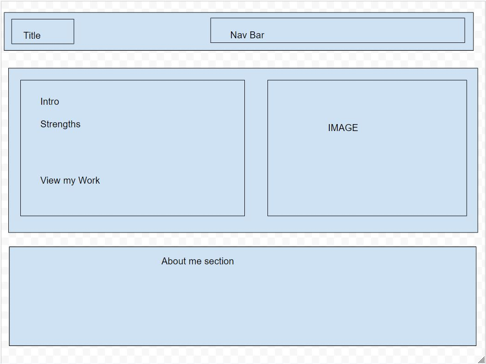
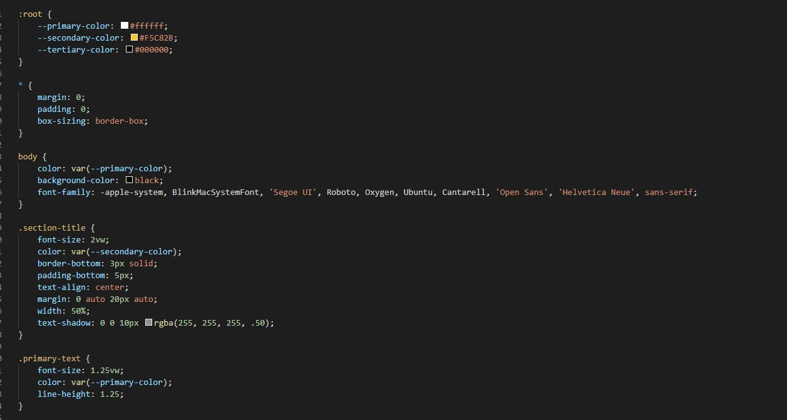

# My Portfolio

## Description
  This is my first time coding an html website with css from scratch. I wanted to incorporate some more design items in the website than what the criteria asked of me. I
  first thought of the lay out I wanted and drew it out on wireframe (which will be linked in the screenshots tab). After that I got the skeleton of the website all layed out and ready 
  to be customized using css. I decided to go and use the :root pseudo class to define my three main colors using variables. This made it easier for me to lock down the color scheme I wanted
  to do. After that I went to work getting my flex boxes ready for all of my sections. That was by far the hardest part for me. It was a combination of poor planning and not knowing the full
  extent of how flex boxes work. Although now I feel very comfortable creating flexbox designs through css. This project was daunting at first to me, but felt so much easier once I had
  a plan of attack! I am most proud of my how some of my utility classes are set up! The most interesting thing by far was writing the base code and going back to streamline things etc.
  
## Installation
  Deployment url below! or if you would like to pull the code and see for yourself,
  git clone "https://github.com/aaronquach123/aaronq-portfolio.git"
## Usage
  Please feel free to submit issues with my code if you see any way I can streamline it or improve it!
## Deployment
https://aaronquach123.github.io/aaronq-portfolio/

## Screenshots

## Credits
I got my hero image from https://wallpaperscraft.com/download/code_lines_programming_130775/3840x2160 
